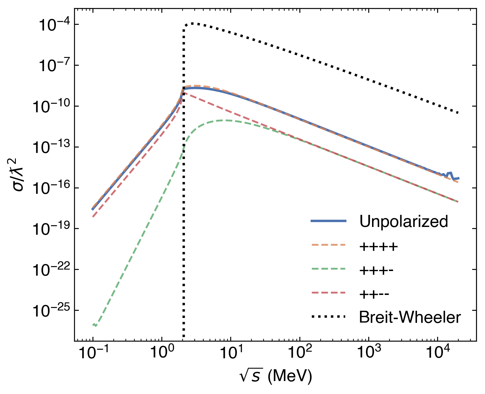

# PhotonX Simulation Plan

## Overview

This simulation code estimates photon–photon scattering event rates using a quasi-hybrid Monte Carlo algorithm. Two colliding photon beams are modeled using lab-frame HDF5 datasets. One beam is treated as a source of test particles (beam 1), and the other as a quasi-static background field (beam 2).

## 1. Input Data

- Input: Two HDF5 files with datasets named `photons` of shape [N, 3]
  - `position`: 4-vector (x, y, z, t) in mm
  - `momentum`: 4-vector (px, py, pz, E) in MeV
  - `weight`: scalar macro-weight
- Units: mm for positions, MeV for energies

## 2. Reference Frame

- Transform all photons to the **Zero Momentum Frame (ZMF)** such that the two beams are counter-propagating.
- Use 4-momentum addition to define the ZMF and apply Lorentz boosts to both beams.

## 3. Beam Representation

- Beam 1: Sampled as test particles, propagated step by step.
- Beam 2: Indexed spatially using a BVH (Boundary Volume Hierarchy) (R-tree via `rstar`), acting as a quasi-background photon field.
- Beam 2 is optionally updated at each step to simulate dynamic propagation.

This implementation is designed to be similar to a PIC simulation - beam 1 is treated using a MC approach, while beam 2 is effectively divided into macroparticles.

## 4. Event Loop

For each time step:
- For each photon in beam 1:
  1. Advance position by $\Delta l = c \cdot \Delta t$
  2. Query nearby beam 2 photons using a search radius, $r$
  3. Select $N_s$ random beam 2 photons from the nearby set
  4. For each sample:
     - Compute Mandelstam invariant $s = (k_1 + k_2)^2$
     - Look up tabulated cross section $\sigma(s)$
     - Estimate interaction probability within cell volume, $V_C$:
       $$
       P = \mathbb{P}(l)\Delta l = \frac{1}{\lambda}\exp\left(-     \frac{l}{\lambda}\right)\Delta l \simeq \frac{\sigma(s_C) \Delta l}{V_C} \cdot \sum_{i\in C}w_i
       $$
     - Perform a Monte Carlo accept/reject test
     - If accepted, generate secondaries

## 5. Cross Sections

- **Linear Breit–Wheeler**: analytic formula
- **Elastic photon–photon scattering**:
  - Pre-tabulated as HDF5 for:
    - Unpolarized differential and total cross section
    - Helicity-resolved cross sections; $|R\rangle, |L\rangle$ is right and left handed respectively:
      $$
        |R\rangle |R\rangle \rightarrow |R\rangle |R\rangle,
        |R\rangle |R\rangle \rightarrow |R\rangle |L\rangle,
        |R\rangle |R\rangle \rightarrow |L\rangle |L\rangle
      $$

## 6. Output

- Number and type of interactions
- Energy and momentum of secondary particles
- Optional spatial or angular histograms

## 7. Optional Enhancements

- Adaptive number of samples $N_s$ based on local density
- Polarization-resolved event generation
- Beam 2 dynamic propagation
- Multiple processes: e.g., Compton emission from secondary leptons, multi-photon contributions

## 8. Benchmarking

- Cross-check against known analytical rates in simple geometries
- Compare output with full pairwise models for low-N beams
- Test Lorentz invariance by checking identical results in boosted frames

---
